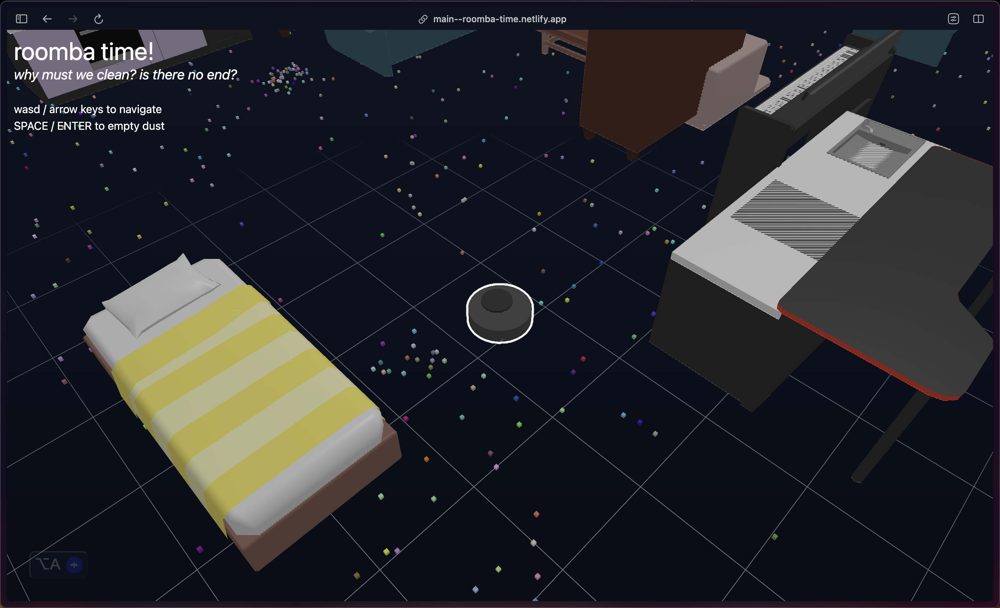

# [Warp 2023](https://threlte.xyz/hackathon) hackathon submission

- _Title_: roomba time!
- _Track_: Wow!
- _Short Description_: roomba time! is an interactive experience where you are a roomba and clean up debris and dust. I was thinking about WALL-E and how existential that movie is. Ideally, I would support sockets for multiplauer but I ran out of time.
- _Team members_: shiva
- _Repo / PR link_: [https://github.com/shivaPeri/warp-2023](https://github.com/shivaPeri/warp-2023)
- _Preview link_: [https://roomba-time.netlify.app/](https://roomba-time.netlify.app/)

- [3D assets source](https://www.turbosquid.com/3d-models/furniture-free-3d-model-2098569)

## documentation

